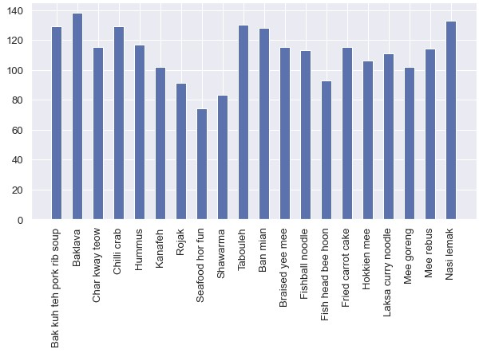
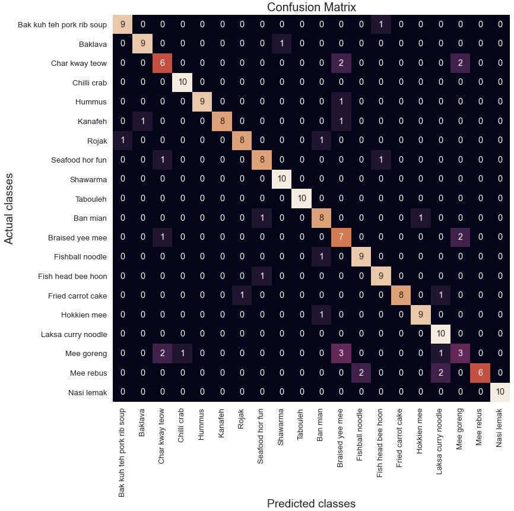
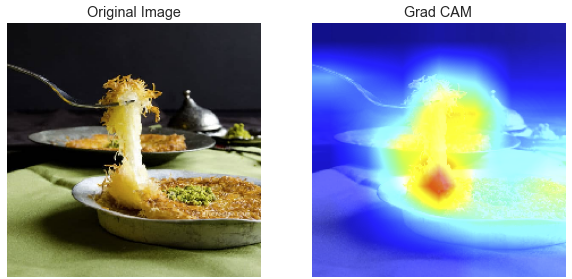
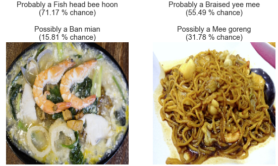

# Transfer Learning, Keras Tuner, Grad-CAM, Azure ML: a CNN-based food classifier model development project, from training to cloud deployment

## Description

This is the source code for a CNN-based food identifier model development project which implements the following techniques:

- Transfer learning: method to leverage the *generic knowledge* acquired by a model trained on massive datasets to develop a more *task-specific knowledge* using only a limited amount of new data. While generic knowledge is used to detect low-level features in an image, such as edges and curves, task-specific knowledge enables the model to recognize higher-level features, such as the shape of an object, and, ultimately, distinguish one food item from another.
- Keras Tuner: hyperparameter optimization framework that helps you pick the optimal set of hyperparameters for your model. It randomly samples hyperparameter combinations (such as dropout and learning rate), tests them out sequentially, and returns the best set of combinations.
- Grad-CAM: technique which provides visual explanations of CNN-type model predictions by highlighting important regions in the image. It is a way of looking into the “black box” of neural networks.

It has been developed using Jupyter Notebook and is based on TensorFlow 2 (Keras API).

The first file (Model development.ipynb) describes the steps to create the model, from loading the images to training and evaluating the model performance.

1. Import libraries
2. Define constants related to the pictures
3. Define constants related to the model
4. Load pictures into memory and generate classes
5. Transfer learning : import the pre-trained model and re-train it with new data
   5-a. Fine-tune hyperparameters with Keras Tuner (optional)
   5-b. Train the model with a fixed set of hyperparameters
6. Save the model to a file
7. Evaluate the performance of the model
8. Visualize the predictions
9. Understand the predictions of the model

The second file (Model deployment.ipynb) describes how to deploy the model to Microsoft Azure ML.

1. Import libraries
2. Install Azure Machine Learning SDK for Python
3. Create a Machine Learning workspace
4. Connect to your ML workspace
5. Register the model from TFSaved Model folder
6. Create an inference configuration
7. Deploy the model to Azure Container Instances
8. Test the endpoint
9. Update the model

Class distribution of training pictures:

Confusion matrix:

Grad-CAM:

Predictions:

